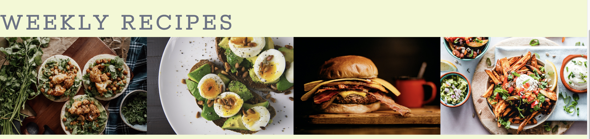
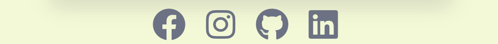
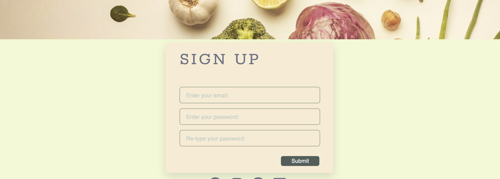

# Food | First - Portfolio Project 1 - HTML/CSS Essentials

Have you ever been in the situation where you are not sue what you fancy for dinner? Food First is the go to site that lets you explore new and exciting recipes that have come from fellow food enthusiasts. Available will be new and exciting weekly recipes and also a gallery that shows what others have created to get inspiration.

## Live Site 
https://kieran132.github.io/Food-First/

## Repository
https://github.com/Kieran132/Food-First

## Contents
- Project Goals
- Target Audience
- Existing Features
    - Navigation Bar
    - Hero Image
    - Weekly Recipes
    - Events
    - Footer
    - Gallery
    - Sign up
- Technologies Used
- Testing
- Deployment
- Credits

## Project Goals
The idea for this project has always been something that I would like to see more when searching for a food recipe. From having a background in food, whenever I try and look for a recipe, most sites just bombard you with recipes in which some are just not relevant. I wanted to make a website that was clean, appealing to the eye and straight forward to what the person was after. In addition to this, I also wanted to add advertising space in the for of an events section.

## Target Audience
The type of people who I am aiming this website at are people who in essence are they lazy type. Instead of them going out looking for a recipe, they would simply come to Food First, see what the weekly recommended recipes are and take it from there. if they dont like what they see then they can click over to the gallery where they are able to see a whole range of dishes.

## Features
The Features within this website are common to all users of the internet. This being in the form of menu/navigation bar and footer. Having a familiar layout that all internet users have experienced, makes the website have a better User experience. From the initial viewing on the home page, people are drawn to the 'normal' areas where they would expect certain placements to be.

### Existing Features

#### Navigation Bar
At the top of each page througout the users time on the website. It contains the wording to each page and also the links that will navigate the user. Whenever the user hovers over Home, Gallery or Sign Up a line appears underneath giving better UX by showing the user where they have pointed the mouse.

#### Hero Image
The hero image, I wanted something that just looked clean and simple. When initially entering the page the colors are not overwhelming or in the users face. The image has few aspects relating it to the website being about food with having a few visible ingredients. Having the initial image cropped to only show these few things, I think has added to the minimalism I was aiming for. I decided to add a little slogan to emphasise how easy it is to find a recipe within this website.

#### Weekly Recipes
Having the images of the weekly recipes visible and right infront of the user gets to the point of the ethos behind the site. Looking for a recipe? There are the weekly highlights. Quick and easy results for the user. All the images are linked and will take the user to the relevant recipe page.

#### Events 
With being a got to website for food enthusiasts, adding on a section that highlights events would broaden the users interaction with the website. Not only would this ossibly add additional income from outsiders using the website for their advertisments of the events but also it would get the user thinking about going to them and add to their interest into food.

#### Footer
The footer ends with how I wanted the website to feel, simple. Only have four icons that link to their relevant sites does this. The four icons are synonymous with everyday life and the user can instantly recognise and relate to where that icon would take them.

#### Gallery
The gallery page showcases the range of recipes available to the user. With being spaced out evenly, the user will not be overwhelmed with the page being over-crowded.

#### Sign Up
This page enable the user to sign up to be able to recieve notifications on the newest recipes available. In addition, the sign up will also all for notifications on the new and future events

## Technologies Used
- HTML5 - basic coding to build a website
- CSS3 - used for styling the website
- Gitpod - used to create the website
- Github - used to store repository of website and deploy website
- Chrome Dev Tools - used to view and experiment with styles
- Font Awsome - used to find the icons 
- Google Fonts - used to find the fonts for the website
- Pexels - provided the images seen throughout the website
- Ui.dev - created a multi image display of webpage on multiple devices
- Eye Dropper - Chrome add on that allowed me to pick the exact color I was after
- Canva - Color pairing tool that showed me which colors went well with the ones i chose

## Testing and Bugs
Click to [here](TESTING.md) to see further information on testing

## Deployment
The website was delpoyed using GitHub. To do this I did the following;
1. When on the websites GitHub repository, click on the settings tab
2. Now on the settings page, on the left hand side of the page, click on the pages tab
3. Under the Source section, click on the drop down menu titled Branch and select main
4. The page is now published with a link available to use.

(https://kieran132.github.io/Food-First/)

## Credits

### Content
- The text throughout the website was taken from [Google Fonts](https://fonts.google.com/)
- The icons in the footer were taken from [Font Awsome](https://fontawesome.com/)

### Media
- The image on the home screen came from [Pexels](https://www.pexels.com/)
- The images on the Home and Gallery pages were taken from [Pexels](https://www.pexels.com/)
- The links used in the weekly recipes are from [BBC-GoodFood] (https://www.bbcgoodfood.com/)
- The icons in the footer are linked to their relevant icon, Facebook, Instagram, Pinterest, Twitter
- Many issues were resolved using [W3School](https://www.w3schools.com/)
- The fabrication of the submit page came from [Free-Code-Camp](https://www.freecodecamp.org/news/how-to-build-sign-up-form-with-html-and-css/)
- To be able to select certain color, Chrome add-on Eye Dropper was used