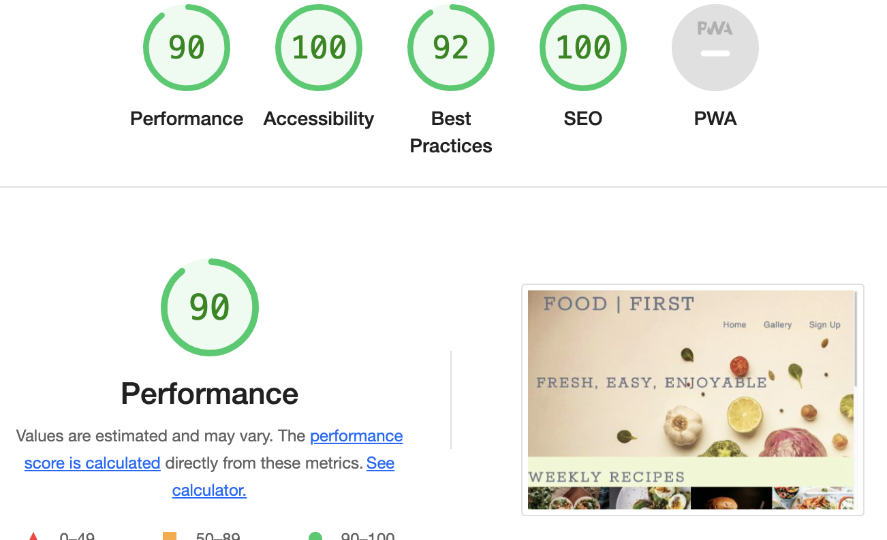

## Testing

### W3C Validator

#### index.html
Passed

#### gallery.html
Passed

#### sign-up.html
Passed

#### confirmation.html
Passed

### (Jigsaw) Validator
Passed

### Lighthouse Testing

## Bugs

- When inserting images into the website, any images that saved as .png or .webp did not show on the deployed website
Resolution - To resolve this issue I converted the images into .jpeg

- Images didnt show on page deployment
Resolution - I removed the / from the start of the file path

- @media only screen min-width 1200px moved everything out of alignment.
Resolution - Change the min-width to max-width and this resolved the issue

- Testing performace was 41%
Resolution - I compressed all the image files on the website which resulted in a quicker page load

- Two errors were found on initial CSS validator on row 232/233 due to no negative values are allowed
Resolution - I removed the negative values and styled accordingly

### Testing

1. On the confirmation page, the footer was too high and didnt fit with the theme of the other pages. To rectify this I added height:vh90; to the styling which increased the height of the text pushing the footer lower on the page

2. When viewing the website on mobile repsonsiveness, the nav bar was not aligned and over spilled onto another line. When testing to sort out this issues, changing the letter spacing enabled to nav bar to realign into one row.